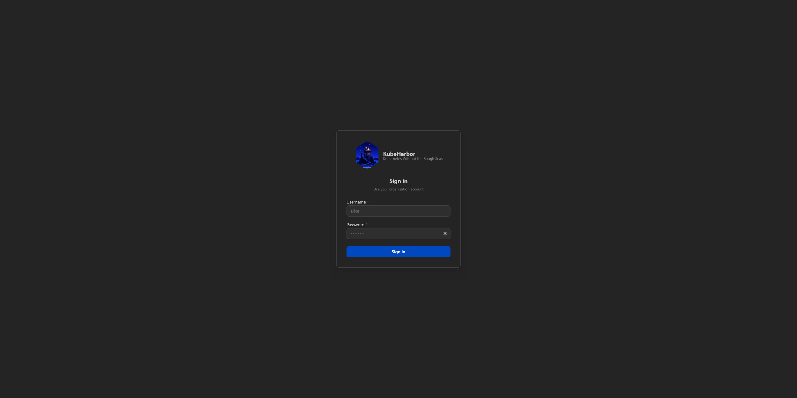
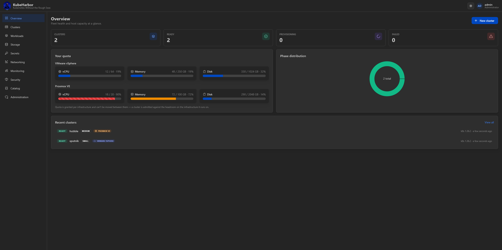

# The portal

The KubeHarbor portal is the front door - a web console for requesting clusters and managing
everything about them. This guide walks through it feature by feature. Everything here is also
available over the [REST API](#the-api-underneath), but the portal is where most people live.

Open it at **http://localhost:8080** and sign in.

New accounts start with **zero quota** - an admin grants each account a slice of capacity before it
can create clusters (or the deployment runs in shared-quota mode). See [Account, teams &
administration](account-and-admin.md).

## The layout

A left-hand navigation rail groups the console into areas. The top bar carries the KubeHarbor logo, a
light/dark theme toggle, and your account menu.

| Area | What it's for |
|---|---|
| **Overview** | Fleet dashboard - cluster counts, your quota per infrastructure, phase distribution, and recent clusters. |
| **Clusters** | The cluster list, the create wizard, and the per-cluster detail page. [→ Creating](creating-clusters.md) · [→ Managing](managing-clusters.md) |
| **Workloads** | Browse and scale the live workloads inside a cluster. [→ Workloads](workloads.md) |
| **Storage** | PersistentVolumeClaims and StorageClasses. [→ Storage](storage.md) |
| **Secrets** | The Vault-backed per-cluster secret store. [→ Secrets](secrets.md) |
| **Registry** | Your cluster's container images, and where to push them. [→ Registry](registry.md) |
| **Networking** | Services, Gateways, Routes, and every exposed app. [→ Networking](networking.md) |
| **Monitoring** | Prometheus/Grafana dashboards, rendered natively. [→ Monitoring](monitoring.md) |
| **Security** | Trivy vulnerability, misconfig, secret, and RBAC reports. [→ Security](security.md) |
| **Catalog** | The add-on library and your own custom catalogs. [→ Catalog](catalog.md) |
| **Administration** *(admin only)* | Accounts, groups, and quota. [→ Admin](account-and-admin.md) |

Most of these pages start with a **cluster picker** (and, where it applies, a namespace picker), so
you choose which Ready cluster to inspect. They only work once a cluster is `Ready`.

## Live, without reloading

The portal polls in the background, so provisioning progress, cluster status, workload state, and the
event timeline all update on their own - you rarely need to refresh. The Activity tab and the Terminal
stream live over SSE and WebSocket.

## The API underneath

The portal is a client of the same JSON + SSE API you can drive directly on **:8081** (or through the
portal's proxy under `:8080/api/…`). Everything the portal does - create, scale, upgrade, delete,
manage users and groups - is an API call. The API is documented by example in the guides that follow,
and `GET /catalog`, `GET /clusters`, `GET /clusters/{id}`, and friends are self-describing.

Start with [Creating clusters](creating-clusters.md).
