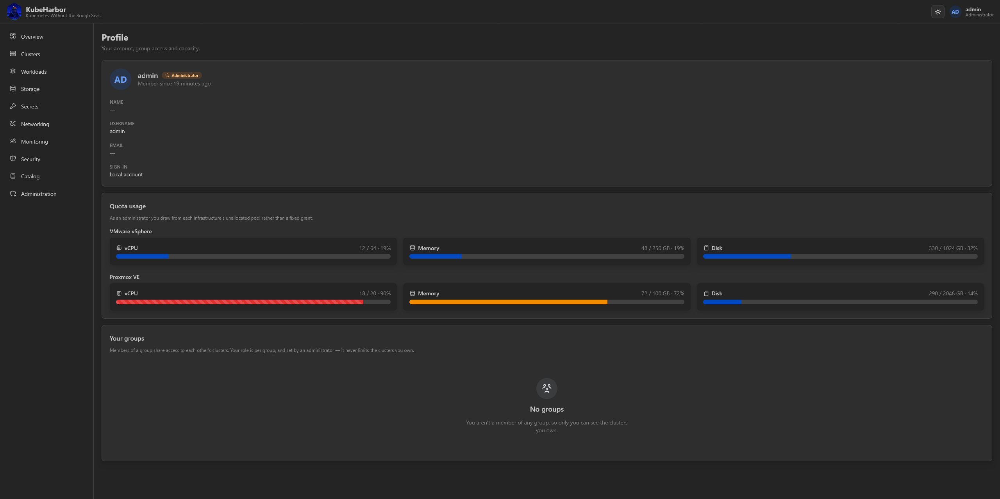
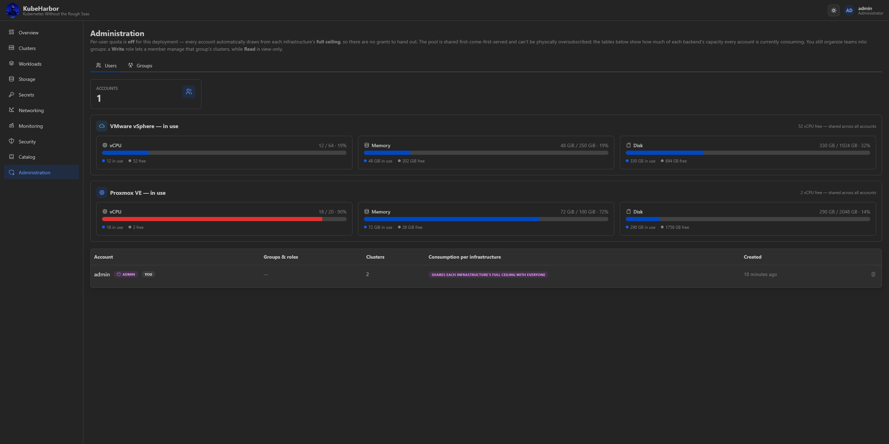
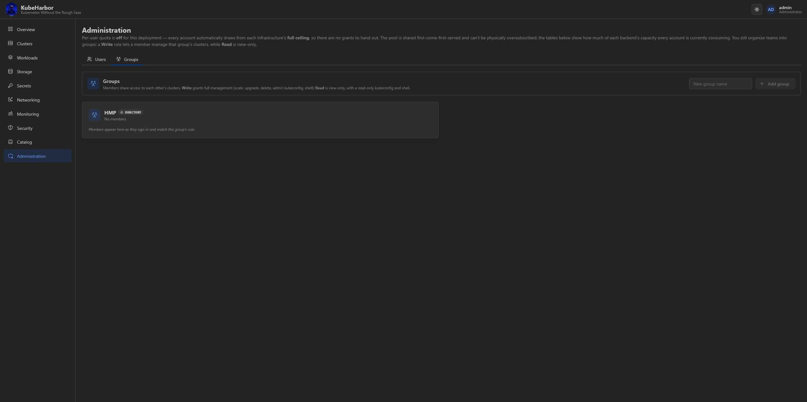

# Account, teams & administration

## Your profile

Your account menu (top right) → **Profile** is your own read-only view of who you are on the platform:
your identity, your **quota and usage per infrastructure**, and the **groups** you belong to with the
role you hold in each.



Quota is what admission checks when you create or scale a cluster - you can see exactly how much
headroom you have on each backend before you hit a wall.

## Groups and roles

A **group** is a team. Members of the same group **share access to each other's clusters**, scoped by a
coarse **read/write role** that is **per group** - you can be `read` in one group and `write` in
another.

- **Read** is view-only: you see the group's clusters and can download a read-only kubeconfig and open a
  read-only shell, but every mutation is refused.
- **Write** is full access - scale, delete, upgrade, an admin kubeconfig, the admin shell - the same as
  the owner.

A user can be in several groups at once; their access to a given cluster is the **highest** role across
every group they share with its owner. You always keep **full control of clusters you own**, whatever
your group roles - roles only ever gate access to *other* members' clusters.

## Administration (admin only)

Admins get an **Administration** area with two pages.

### Users



Every account, its usage, and the platform's unallocated headroom. From here an admin **grants quota**
(per infrastructure) and can **delete accounts** (which cascades to deleting their clusters).

Quota is a **conserved pool, per infrastructure**: the sum of all non-admin grants on a backend can't
exceed that backend's ceiling. The admin holds no fixed slice - its own budget on each backend is
simply whatever hasn't been granted yet, so granting a tenant never requires shrinking anything first.
Capacity is **never fungible between backends** - a KVM grant can't fund a vSphere VM.

> In **shared-quota mode** (`KAAS_SHARED_QUOTA=true`) there are no per-user grants: every account draws
> from each backend's full ceiling, first-come-first-served (the aggregate cap still prevents
> oversubscription). This page then shows per-account *consumption* instead of a grant editor.

### Groups



Create, rename, and delete groups, and manage each user's memberships and per-group role.

Groups come from one of two sources, and they coexist:

- **Local** groups are managed here in the portal.
- **Directory** groups come from an [Active Directory / LDAP mapping rule](../deploy/integrations/directory-auth.md),
  are badged *Directory*, and are recomputed on each member's login - the portal shows them read-only
  (renaming or deleting one is done by editing the mapping config).

Deleting a group only removes it from its members' memberships; it never touches their clusters or their
other memberships.

## Doing it over the API

```bash
# admin: accounts + usage + allocation summary
curl -b jar localhost:8081/users
# admin: grant quota (merges per infrastructure) and/or set memberships
curl -b jar -XPATCH localhost:8081/users/<id> \
  -d '{"quotas":{"kvm":{"vcpu":8,"mem_mb":12288,"disk_gb":100}}}'
# admin: manage groups
curl -b jar -XPOST localhost:8081/groups -d '{"name":"team-a"}'
# your own profile (identity, quota, groups with names resolved)
curl -b jar localhost:8081/auth/profile
```
