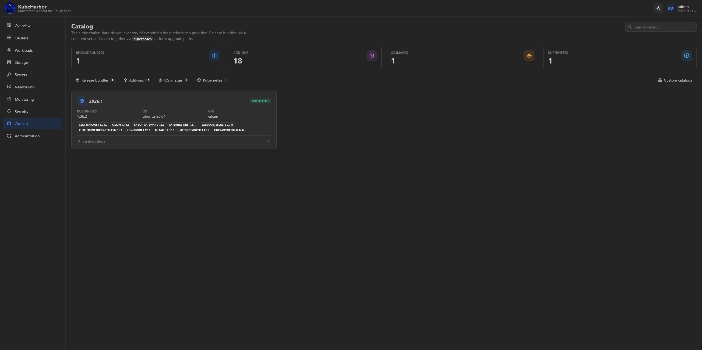
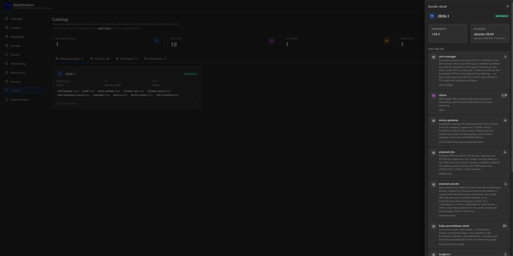
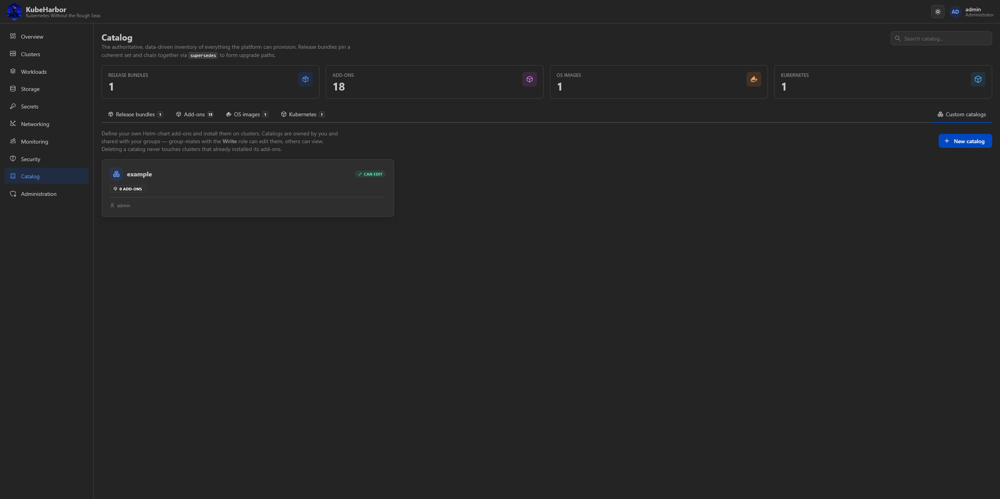
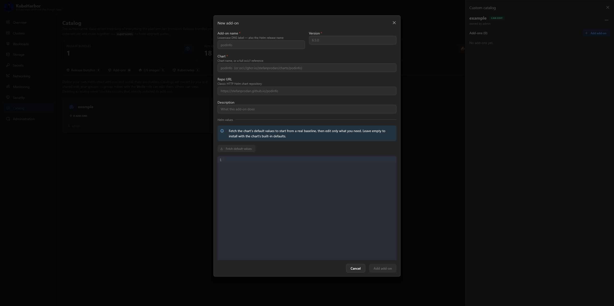

# Catalog & custom catalogs

## The catalog

The **Catalog** page is a read-only browser of everything KubeHarbor can install: OS images, Kubernetes
versions, add-ons, and **release bundles**. It's what the create wizard and the Add-ons tab draw from.

Click an entry for its details - an add-on's chart, repo, version, namespace, and description; a
bundle's pinned component set.

### Release bundles

A **bundle** names a coherent, version-pinned set - one OS image, one Kubernetes version, one CNI, and a
set of add-on versions. Bundles chain into upgrade paths (each hop advancing Kubernetes by at most one
minor), which is what makes [cluster upgrades](managing-clusters.md#upgrades) a supported, one-click
operation rather than a manual dance. Cutting a new release is a data edit to the catalog, not a code
change.

### The add-on library

Beyond the default bundle's add-ons, the catalog carries optional ones you can add to any cluster -
GitOps (**Argo CD**, **Flux**), policy (**Kyverno**), cost
(**OpenCost**, **Kepler**), an identity provider (**Keycloak**), alternative storage (**OpenEBS**), and
more. Add them from a cluster's [Add-ons tab](managing-clusters.md#add-ons), with an optional per-cluster
values override.

There is no image-registry add-on: the platform runs **one central Harbor** beside the control plane
and gives every cluster a private project in it, so an in-cluster registry would be a second, worse
copy of something every cluster already has. See [Registry](registry.md).

## Custom catalogs

Custom catalogs let you define your **own** Helm-chart add-ons - with no change to the built-in catalog
- and install them on clusters just like the built-in ones.

A catalog is a named collection of add-on definitions, each with a chart, repo, version, namespace, and
a default Helm values document. The authoring UI can fetch a chart's default values for you (which also
validates the chart URL).

Custom catalogs are **owned and shared exactly like clusters** - the owner and admins have full access,
and group-mates get view or edit per their [group role](account-and-admin.md). When you select a custom
add-on onto a cluster, its chart definition is *copied* onto the cluster, so deleting the catalog later
never disturbs clusters that already installed its add-ons.
