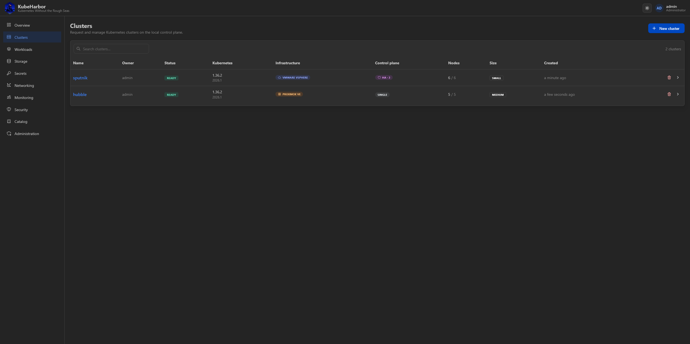
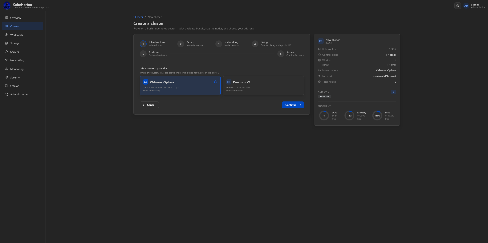
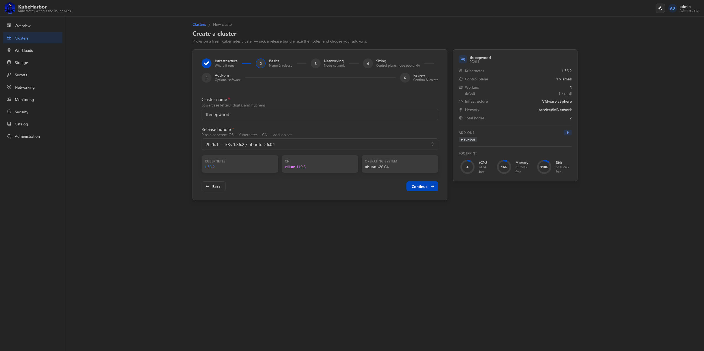
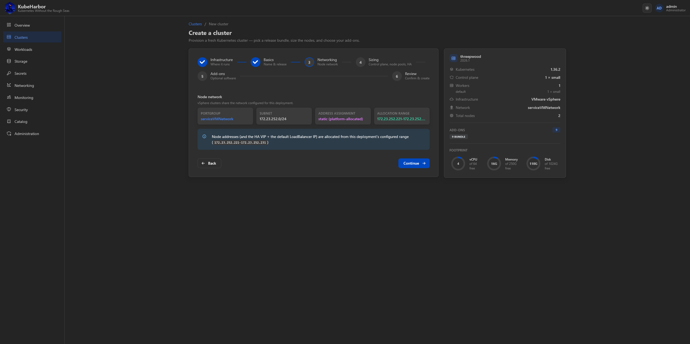
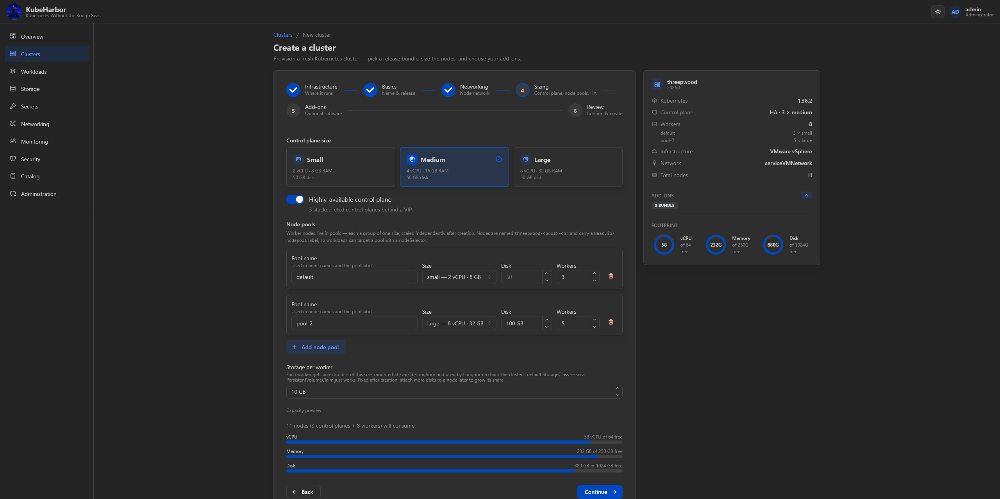
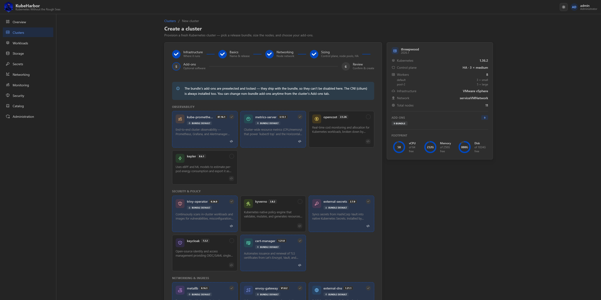
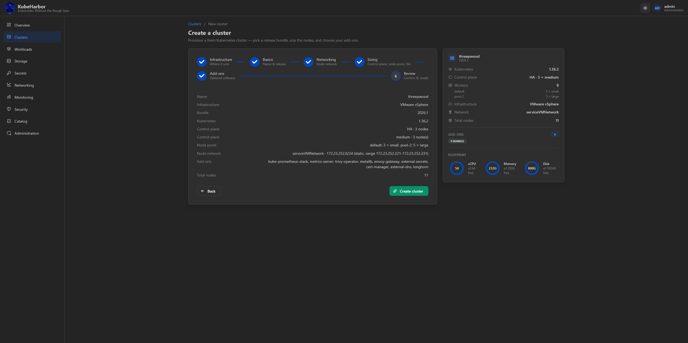

# Creating clusters

The **Clusters** page lists every cluster you can see - your own, and any shared with you through a
[group](account-and-admin.md). Each row shows a live status badge, the Kubernetes version, the
control-plane topology, node counts, the infrastructure, and who requested it.



Click **New cluster** to open the create wizard.

## The wizard

The wizard walks through a handful of steps, with a **live summary panel** on the right that updates as
you go - the cluster's shape, its node count and add-ons, and a **footprint** of vCPU / memory / disk
against your free capacity, so you see whether the cluster fits your budget before you submit.

### 1. Infrastructure

If the deployment offers more than one infrastructure, you first choose **where the cluster runs** -
libvirt/KVM, vSphere, or Proxmox. This is **fixed for the life of the cluster**. (With a single
infrastructure enabled, this step is skipped.)



### 2. Basics

A **cluster name** (unique, lowercase letters/digits/hyphens) and a **release bundle** - which pins a
coherent OS + Kubernetes + CNI + add-on set. The step shows exactly what the bundle resolves to.



### 3. Networking

The cluster's **node network**. On the shared-network providers (vSphere/Proxmox) this shows the
portgroup/bridge, subnet, and addressing mode (DHCP or platform-allocated static, with its allocation
range) - deployment configuration you're confirming, not choosing. On KVM this is where the per-cluster
network CIDR is set (auto-allocated or your own).



### 4. Sizing

The **control-plane size** (`small` / `medium` / `large`), a toggle for a **highly-available** (3-node)
control plane, one or more **node pools** of workers, and the **storage-per-worker** disk that backs the
cluster's default Longhorn StorageClass. A **capacity preview** at the bottom mirrors the quota check.



### 5. Add-ons

The **add-ons** to install. The bundle's set is preselected and locked (they ship with the bundle and
the CNI is always installed); the optional ones - grouped by category - are yours to toggle, and you can
add your own [custom-catalog](catalog.md) charts too. Anything here can also be changed later from the
cluster's Add-ons tab.

Where the deployment sets [`KAAS_BUNDLE_ADDONS_OPTIONAL`](../deploy/configuration.md#capacity-budget--quota)
the bundle's add-ons are **not** locked: they stay preselected, but you can turn any of them off - which
is what a host too small to carry the whole batteries-included set needs. The banner above the picker
tells you which of the two you are looking at.



### 6. Review

A final summary of everything, and **Create cluster**.



Only a **name** is strictly required - everything else has a sensible default, so you can click straight
through to Review for a standard cluster.

## What a default cluster ships with

This is the heart of KubeHarbor's "batteries included" stance: a cluster isn't handed over bare. Unless
you deselect them, every cluster comes up with a coherent, version-pinned set of add-ons already
installed and wired together:

| Capability | Add-on | You get… |
|---|---|---|
| Networking (CNI) | **Cilium** | pod networking, out of the box |
| Persistent storage | **Longhorn** | a default StorageClass - a bare PVC just works |
| North-south ingress | **MetalLB + Envoy Gateway** | a reserved LoadBalancer IP and a default Gateway |
| TLS | **cert-manager** | HTTPS-ready routes by default (self-signed in the lab) |
| DNS | **external-dns** | app hostnames published automatically ([if DNS is configured](../deploy/integrations/dns.md)) |
| Secrets | **External Secrets** | Vault-backed secrets materialised in-cluster ([Secrets](secrets.md)) |
| Monitoring | **kube-prometheus-stack** | the [Monitoring page](monitoring.md) |
| Metrics | **metrics-server** | the resource-usage gauges |
| Security scanning | **Trivy Operator** | the [Security page](security.md) |

On top of these, **API-server audit logging is on by default** (the [Audit tab](managing-clusters.md)),
without any add-on.

## Node pools

Workers live in **node pools** - named groups of workers, each at its own size, scaled independently.
`Control-plane size` sizes the control plane only; workers are sized by their pool. Every cluster is
created with a pool called `default`, but that's just a starting shape - you can scale it, delete it,
add more (a `gpu` pool at `large`, say), or run a control-plane-only cluster with no pools at all.

A pool's membership is published as the node label `kaas.io/nodepool=<name>`, so you can pin a workload
to a pool with a nodeSelector:

```yaml
spec:
  nodeSelector:
    kaas.io/nodepool: gpu
```

A pool's **size and root-disk size are immutable** - to move workers to a different size, add a pool at
the new size and drain the old one away (the GKE/EKS node-group shape).

## Single node vs. HA

- **Single node** (the default) - one control-plane VM. Simple, and fine for most lab work. A single
  control plane is still protected: it's backed up on a cadence and can be rebuilt from a snapshot (see
  [Keeping clusters healthy](../concepts/keeping-clusters-healthy.md)).
- **HA** - three control-plane VMs with stacked etcd behind a keepalived/haproxy VIP, surviving the
  loss of any one node.

On the shared-network providers (vSphere/Proxmox) in DHCP mode, an HA cluster asks you for the **API
VIP** in the wizard, because only you know what's free outside the DHCP pool.

## Doing it over the API

Every wizard field maps to the create request:

```bash
curl -c jar -XPOST localhost:8081/auth/login -d '{"username":"admin","password":"admin"}'
curl -b jar -XPOST localhost:8081/clusters -d '{
  "name": "demo",
  "size": "small",
  "node_pools": [{ "name": "default", "size": "small", "desired_workers": 2 }],
  "ha": false
}'
curl -b jar -N localhost:8081/clusters/<id>/events     # watch it converge, live
curl -b jar localhost:8081/clusters/<id>/kubeconfig    # once Ready
```

`size` is the control plane's; `bundle` picks a version set (defaults to the latest); `addons` and
`custom_addons` pick the add-on set; `provider` names the infrastructure. JSON is `snake_case`
throughout.

Once the cluster is `Ready`, move on to [Managing a cluster](managing-clusters.md).
