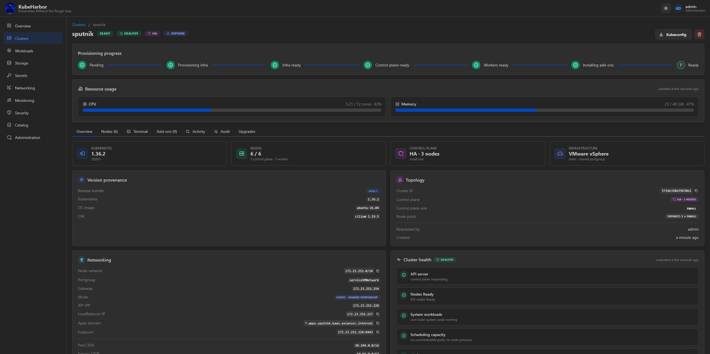
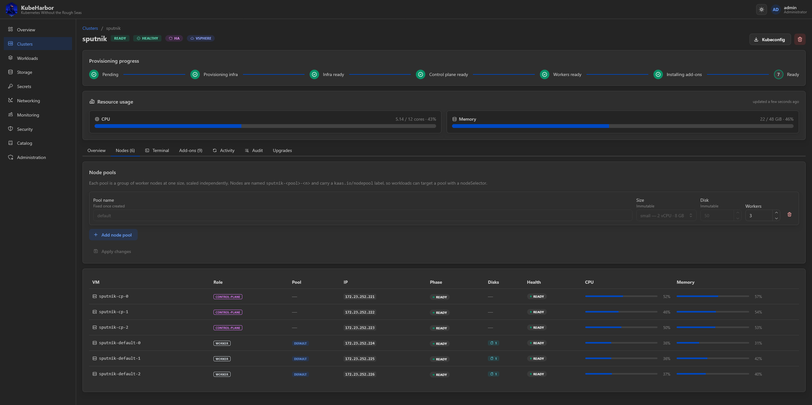
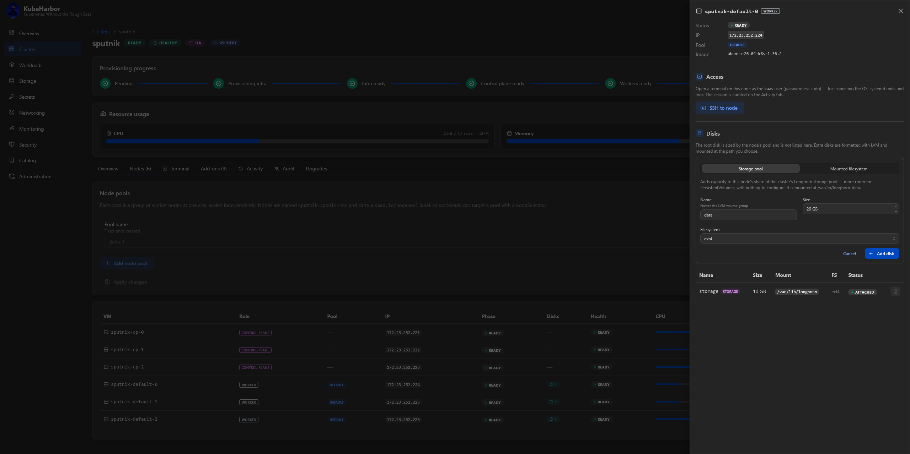
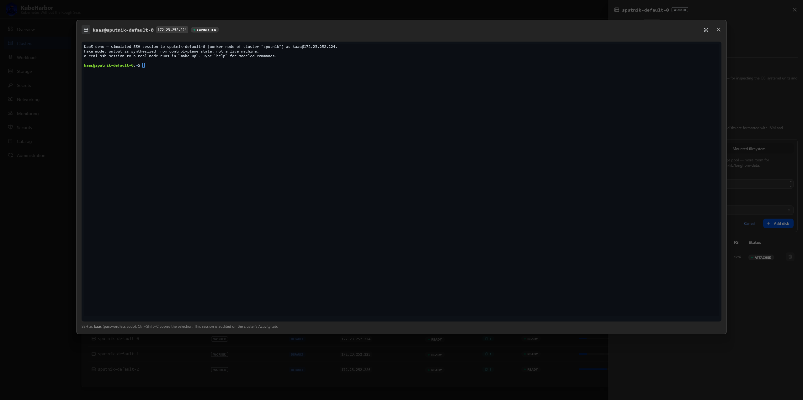
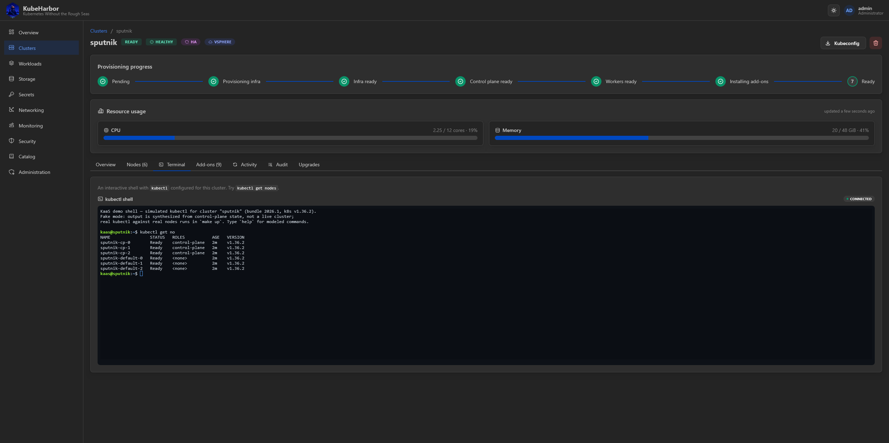
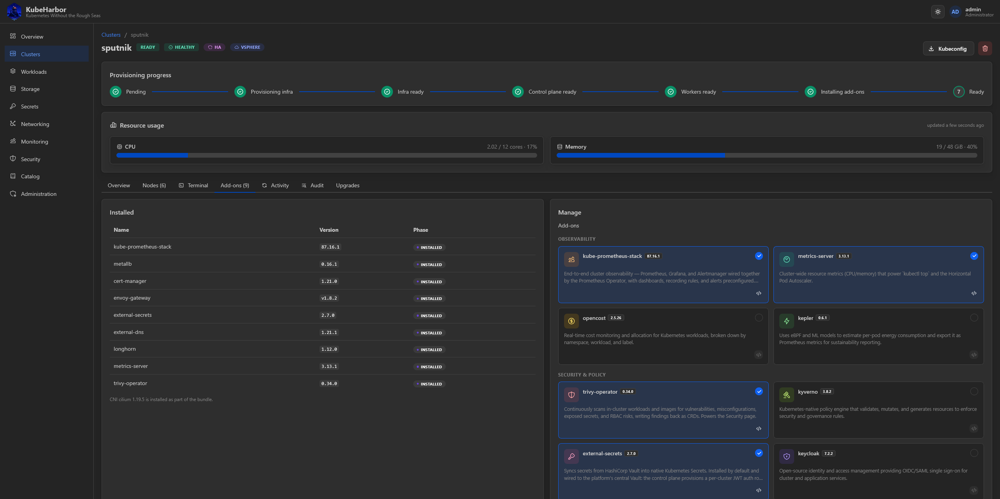
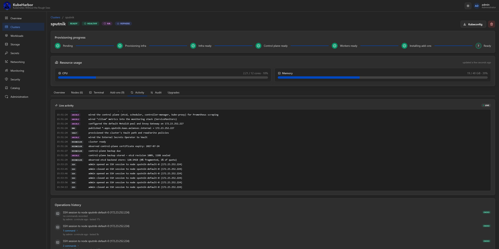
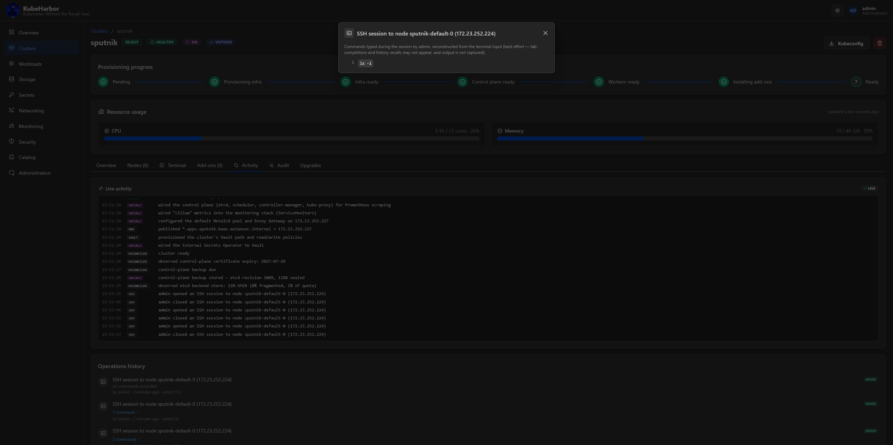
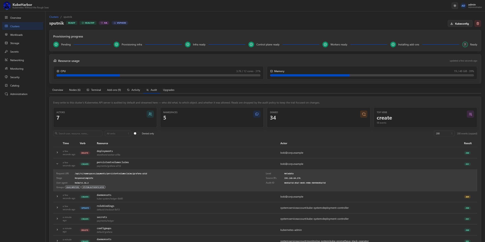
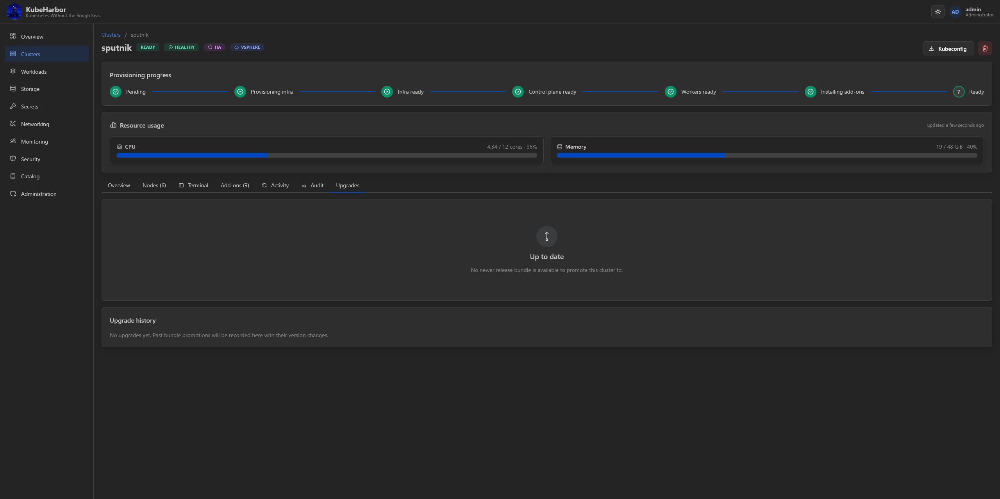

# Managing a cluster

Clicking a cluster opens its detail page - the hub for everything about one cluster. The top of the
page is always visible: the cluster name with **status, health, topology, and infrastructure** badges,
a **Kubeconfig** download and a delete button, a **provisioning-progress stepper** that shows exactly
where a building cluster is, and **resource-usage gauges** (live CPU and memory from metrics-server).



Below that is a row of tabs.

## Overview

The default tab summarises the cluster:

- **Version provenance** - the release bundle and the exact OS, Kubernetes, and CNI versions it pins.
- **Topology** - the cluster ID, control-plane shape and size, and the node pools.
- **Networking** - the node network, gateway, **API VIP**, **LoadBalancer IP**, **apps domain**, the
  API endpoint, and the pod/service CIDRs.
- **Cluster health** - the per-check breakdown (API server, nodes Ready, system workloads, scheduling
  capacity, etcd, certificates, backups, add-ons). Health is an axis of its own: a `Ready` cluster can
  still report `degraded` here. See [Keeping clusters healthy](../concepts/keeping-clusters-healthy.md).

## Nodes

The Nodes tab lists every VM - control planes and workers - with role, pool, IP, and per-node Ready and
resource state.



Click a node to open its **detail pane** on the right, which is the home for per-node actions -
including its **extra disks**.



### Extra node disks

Beyond its root disk, a **running** worker can carry extra data disks - the way to give a node more
storage without rebuilding it. Add one from the node pane (default mount `/var/lib/longhorn-<name>`,
which feeds the Longhorn pool; or any other path for a plain filesystem). The disk is created,
attached, formatted with LVM, and mounted, and it's charged to your disk quota.

Disks are keyed on the node's VM name, so a node rebuilt underneath (a repair or OS upgrade) keeps them
and their data. Removing a disk is safe and sequenced - it's unmounted and its LVM torn down in the
guest *before* it's detached and destroyed - but **removing a disk destroys its data**.

Over the API:

```bash
curl -b jar -XPOST localhost:8081/clusters/<id>/disks \
  -d '{"vm_name":"demo-default-0","name":"data","size_gb":50,"mount_path":"/var/lib/data"}'
curl -b jar -XDELETE localhost:8081/clusters/<id>/nodes/<vm>/disks/<disk>
```

### SSH into a node

Each node has an **SSH** button that opens a browser terminal *inside the VM*, as the `kaas` user, for
OS-level inspection the kubectl shell can't do - systemd, journald, disks.



Node SSH is **write-scoped** (a read-only group member can't use it) and, unlike everything else, works
even before the cluster is Ready - a half-provisioned node is exactly when getting onto the box to read
`journalctl` is most useful. Sessions idle out after 30 minutes and are **audited**: every open/close,
and the commands you type, are recorded on the Activity tab (see below).

## Terminal

The Terminal tab is an interactive **`kubectl` shell** on the Ready cluster, right in the browser.



It runs as **your own identity and role**: a write-role user gets a `cluster-admin` credential, a
read-role group member a read-only one (they can `kubectl get` but not mutate). Everything you run is
attributed to your real username in the cluster's audit trail. The shell runs in a hardened, isolated
sandbox that holds none of the platform's secrets.

## Add-ons

The Add-ons tab shows what's installed and lets you add or remove add-ons from the [catalog](catalog.md)
(built-in or your own custom charts). Each add-on can carry a per-cluster **values override**, edited in
an in-browser YAML editor with a live diff against the chart defaults.



This is also where you **scale workers** - editing a node pool's worker count (or adding/removing a
pool) is the same declarative edit. Any change moves the cluster `Ready → Updating` and converges.

## Activity

The Activity tab is the **live provisioning timeline** - every step the reconciler takes, streamed as
it happens (tofu, Ansible, and Helm output included). Opening it long after a cluster converged still
shows the full history.



Below the raw stream is the **Operations history** - one entry per user intent (create, scale, add-ons,
upgrade), each attributed to who triggered it. **SSH sessions appear here too**, and you can expand one
to see the commands that were typed during it (best-effort, reconstructed from the terminal input).



## Audit

The Audit tab renders the cluster's **Kubernetes API-server audit trail** - a filterable "who changed
what" feed (verb, actor, resource, response, timestamp) with per-event detail. Audit logging is on by
default in every cluster.



Because interactive kubectl surfaces run as your real identity, the audit trail records the actual
username behind each change rather than a shared `kubernetes-admin`.

## Upgrades

The Upgrades tab lists the release bundles this cluster can be promoted to, and executes a promotion.



A bundle pins a coherent set of versions, and the platform advances one hop at a time, routing each
changed component to the right strategy:

- **Kubernetes minor change** → in-place `kubeadm` upgrade (the VMs are kept).
- **OS change** → rolling node replacement, one node at a time - HA keeps etcd quorum; a single control
  plane is rebuilt from a backup onto the same IP, with a brief outage.
- **CNI / add-on version change** → `helm upgrade`.

Promotion charges no extra quota (the node count is unchanged), and progress is visible in the event
log. It requires the target's golden images to be built - see [Golden images](../deploy/golden-images.md).

## Deleting

The delete button (or `DELETE /clusters/{id}`) moves the cluster to `Deleting`; the reconciler drains
it, tears down its infrastructure, and withdraws its DNS and Vault state first. An orphan-GC sweep is
the safety net if anything is left behind.
