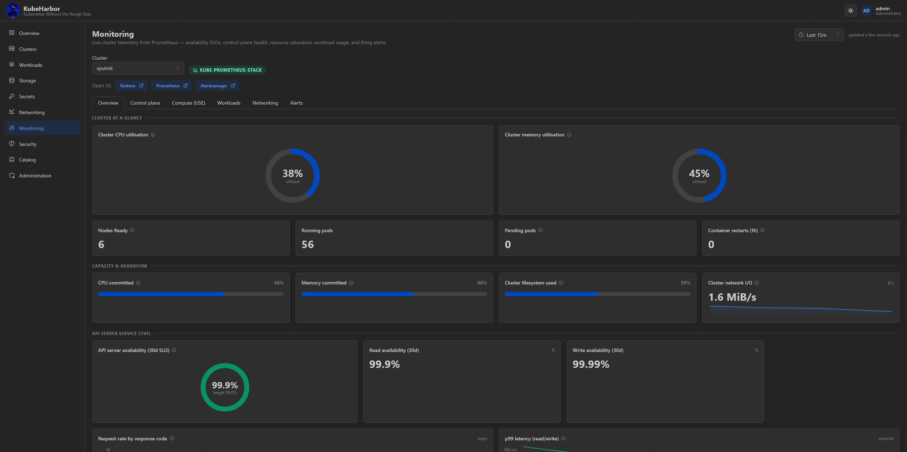
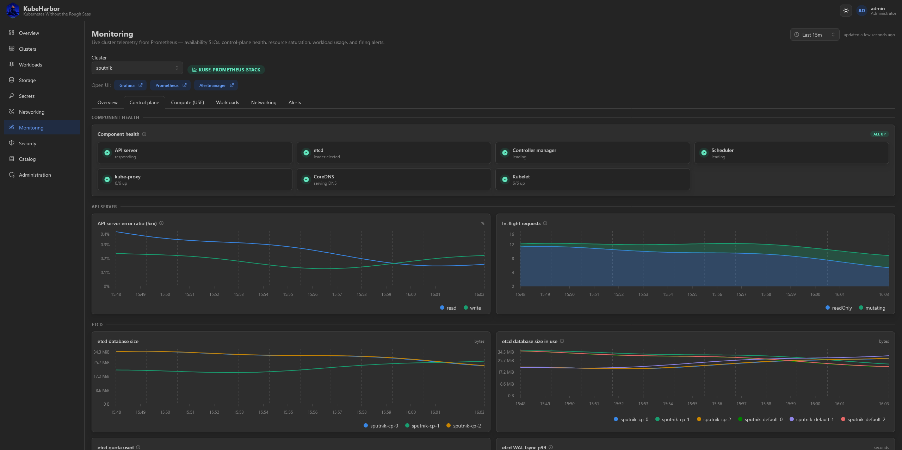
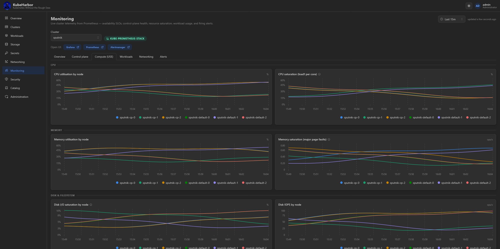
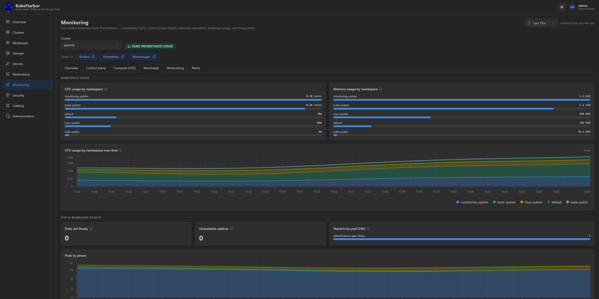
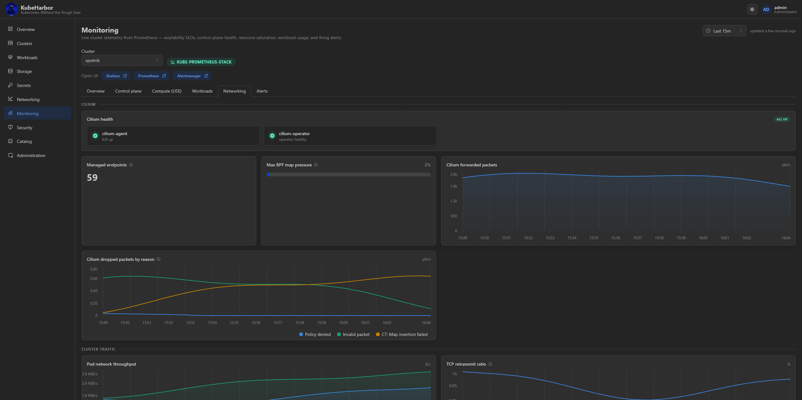
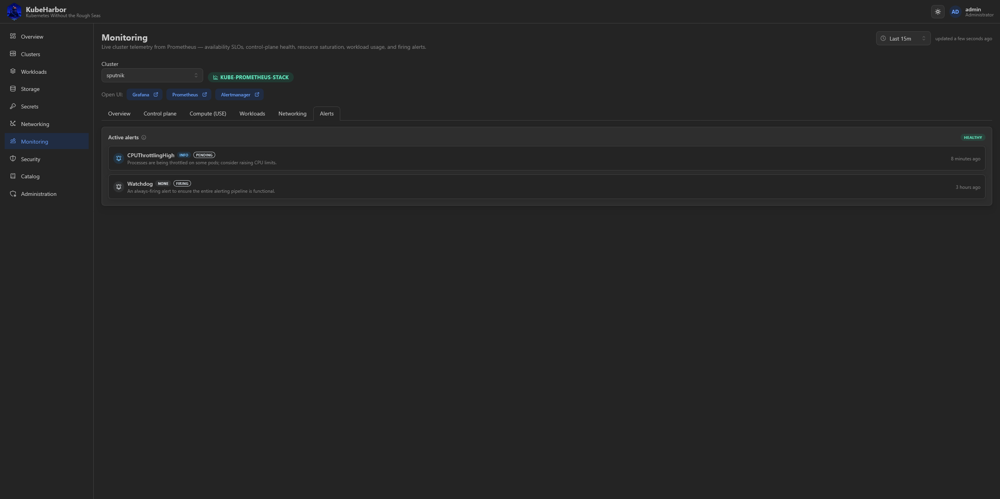

# Monitoring

The **Monitoring** page renders native dashboards from a cluster's in-cluster Prometheus - installed by
the **kube-prometheus-stack** add-on, which ships in every default cluster. Pick a cluster at the top;
a **time-range picker** (5m to 12h) drives every time-series panel.

The dashboards are organised into tabs, each a set of curated panels - gauges, stat tiles, time-series,
and top-k lists - driven by PromQL against the cluster's own Prometheus.

## Overview

An API-server availability SLO and the cluster's capacity commitments (requests vs. allocatable).

## Control plane

Health of every control-plane component - the API server, etcd (including backend-store size and quota
headroom), the controller-manager, scheduler, kube-proxy, CoreDNS, and the kubelets.

KubeHarbor wires the control plane to be scrapeable for you - kubeadm's defaults bind several of these
components' metrics to loopback, and the platform opens them up when the monitoring stack is installed.

## Compute

USE-method resource saturation - utilisation and saturation for CPU, memory, disk, and network.

## Workloads

Per-namespace and per-pod resource usage.

## Network

Cilium networking metrics.

## Alerts

The alerts currently firing, from the stack's own alerting rules.

## Open Grafana / Prometheus / Alertmanager

The page also links straight into the stack's own web UIs - Grafana, Prometheus, and Alertmanager -
through the platform's [in-cluster UI tunnel](networking.md), same-origin, with no separate login.
Grafana receives your role as an auth-proxy identity (view → Viewer, write → Editor); Alertmanager
(which can silence alerts and ships no auth of its own) is gated on write access.
