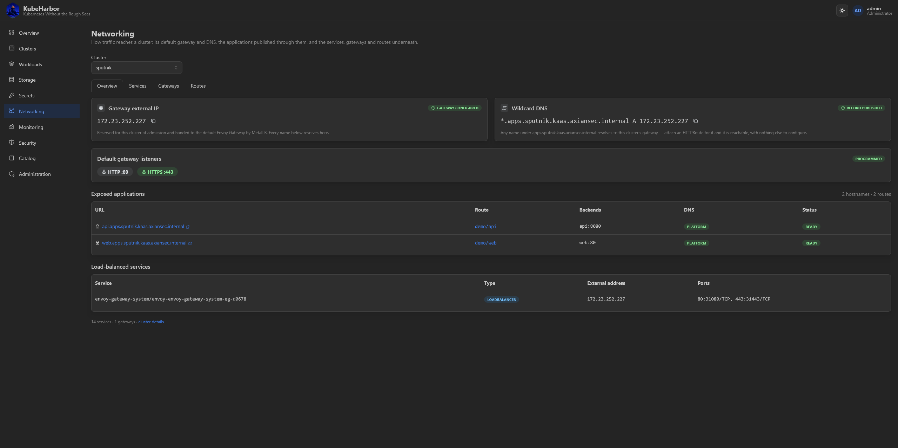
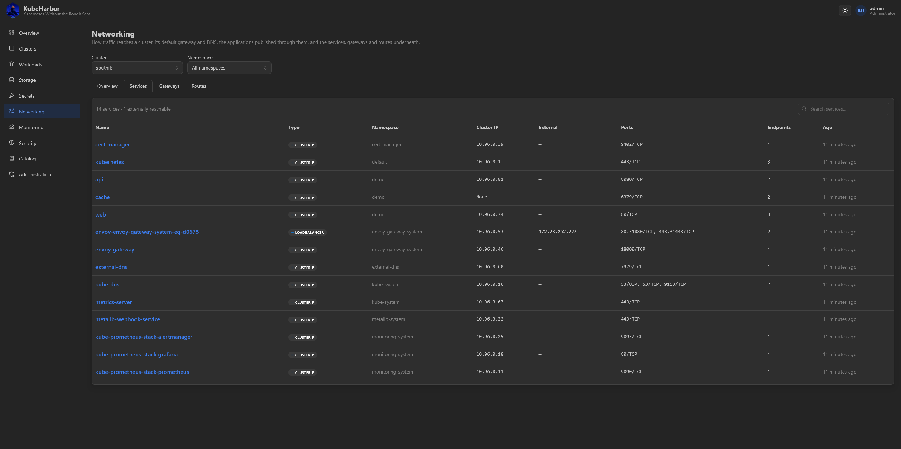
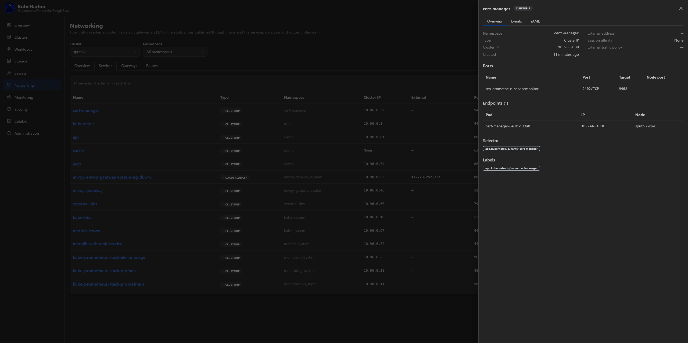
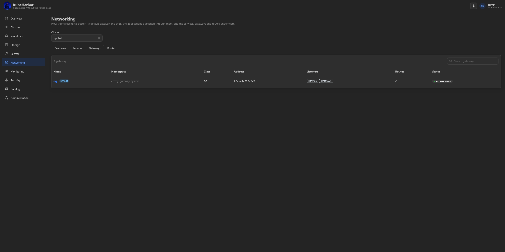
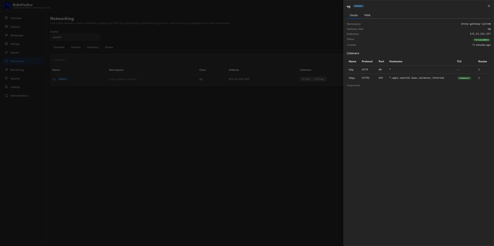
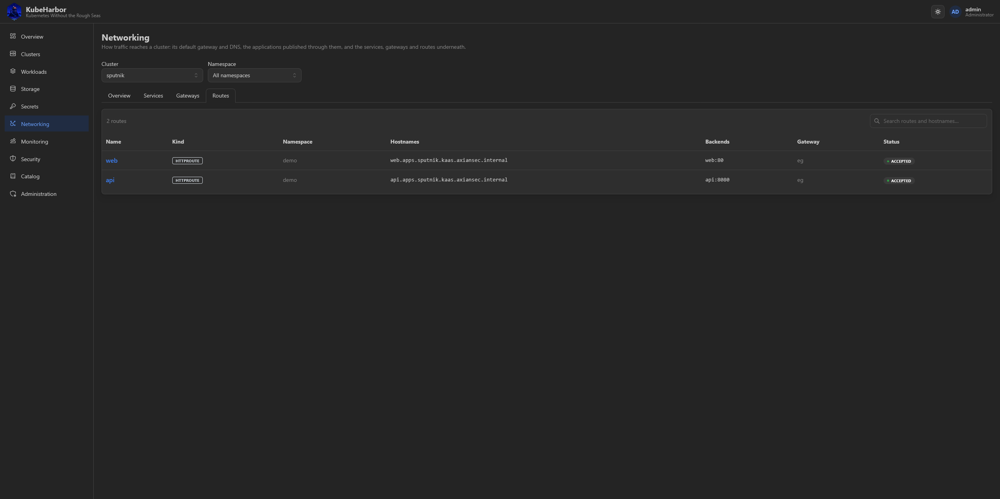
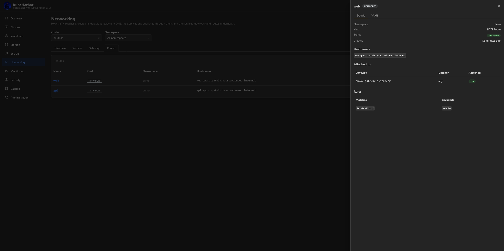

# Networking

The **Networking** page is where a cluster's north-south contract becomes visible - the reserved
ingress address, the default Gateway holding it, the wildcard DNS record pointing at it, and every
application reachable from outside - alongside the raw objects it's all built from. Pick a cluster (and
namespace) at the top.

## Overview

The Overview puts the whole contract in one place:

- the reserved **LoadBalancer IP** and whether the default Gateway has been wired to it;
- the **wildcard DNS record** (`*.apps.<cluster>.<domain>`) and whether it's been published;
- the default Gateway's **listeners** (so "is HTTPS on?" is one glance);
- **exposed applications** - every hostname reachable from outside, with its URL, the route publishing
  it, its backends, and whether it's covered by the platform's wildcard or a name you brought yourself.

Getting an app on the internet is deliberately trivial: deploy it, then attach an `HTTPRoute` for a
name under the apps domain to the default Gateway, and it resolves and routes over HTTPS with nothing
else to configure. See [Cluster DNS](../deploy/integrations/dns.md) for the address-and-record machinery.

## Services, Gateways, Routes

Three tabs over the underlying objects, each with a detail drawer and YAML.

**Services** - every Service in the namespace, load-balanced ones highlighted (the *other* way out of a
cluster).

**Gateways** - the Gateway API Gateways, their listeners, and their addresses.

**Routes** - the HTTPRoutes, their hostnames, parent Gateways, and backends.

## Notes

- The page is **read-only** and works on your own credential - no admin shortcut.
- A cluster with the Gateway API deselected isn't an error here - the Gateway/Route tabs simply come
  back empty, and the Services tab and the platform half of the Overview keep working. There's
  deliberately no add-on gate: the reserved address is still the cluster's.
