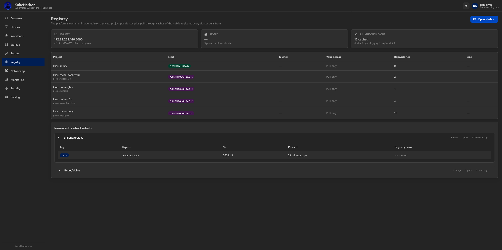

# Registry

The **Registry** page is where your cluster's container images live. Every cluster gets a private
project in the platform's image registry, and you can push to it from the moment the cluster is
ready.

Unlike Workloads or Storage there is no cluster picker here: there is one registry, shared by the
whole platform, and the cluster is a column rather than a filter.

> This page appears only on deployments that run a registry. Without one it says so and does nothing
> else. See [the operator guide](../deploy/integrations/registry.md).



## What you see

**The header** shows the registry's address, its version, and how you sign in to it. **Open Harbor**
takes you to the registry's own console — for browsing tags, configuring retention, or reading a full
vulnerability report.

**Three summary cards:**

- **Registry** — the address you push to, and whether accounts come from the directory or from the
  registry's own user database.
- **Stored** — how much the projects you can see are using, across how many repositories.
- **Pull-through cache** — whether the platform proxies the public registries, and how many
  repositories it has cached so far. This is the number that grows as your clusters install add-ons;
  it is the platform pulling those images once instead of once per node per cluster.

**The project table** lists every project you can reach:

| Kind | What it is |
|---|---|
| **Cluster** | One cluster's own private images. Named `kaas-<cluster name>`. |
| **Pull-through cache** | A proxy of a public registry (Docker Hub, ghcr.io, quay.io, registry.k8s.io). |
| **Platform library** | Images the operator publishes for every cluster. |

**Your access** is the same access you have to the cluster behind the project:

| Your role on the cluster | Here |
|---|---|
| Owner (or platform admin) | Full |
| Team member with **write** | Pull + push |
| Team member with **read** | Pull only |

You cannot see the projects of clusters you have no access to at all.

## Browsing images

Click a project to expand it. Each repository lists its images with their tags, size and when they
were pushed.

> Vulnerabilities are not shown here. The [Security](security.md) page is where the platform reports
> them, from the Trivy operator running inside each cluster — what is **actually running**, rather
> than what a registry scanned at push time. The registry still scans on push and refuses to serve
> the worst findings; that enforcement happens whether or not anyone looks at this page.

## Pushing an image

Your cluster's project name is minted by the platform, so the push prefix is shown for you — on this
page when a cluster project is expanded, and on the cluster's own Overview tab.

```bash
docker login <registry host>
docker tag myapp:latest <registry host>/kaas-dev/myapp:latest
docker push <registry host>/kaas-dev/myapp:latest
```

Nothing else is needed to pull it back: the platform applies a `kaas-registry` pull secret to the
cluster's `default` namespace, and writes the same credential to the cluster's Vault path so
[External Secrets](secrets.md) can sync it into any other namespace.

```yaml
spec:
  imagePullSecrets:
    - name: kaas-registry
  containers:
    - name: app
      image: <registry host>/kaas-dev/myapp:latest
```

## Signing in to the registry

**If your platform uses directory accounts**, sign in to the registry with the same directory
credentials you use here — there is nothing to set up.

**If your platform uses local accounts**, use **Generate password**. The platform mints a registry
password, applies it to your account, and shows it **once** — it stores nothing, so keep it
somewhere. Press it again to rotate. If the button is not there, your deployment either uses the
directory or has not given the portal permission to set passwords; ask your operator.

## Deleting a cluster

A cluster's project — and every image in it — is removed when the cluster is deleted. Push anything
you want to keep somewhere else first, or ask your operator about `KAAS_REGISTRY_RETAIN_PROJECT`.
