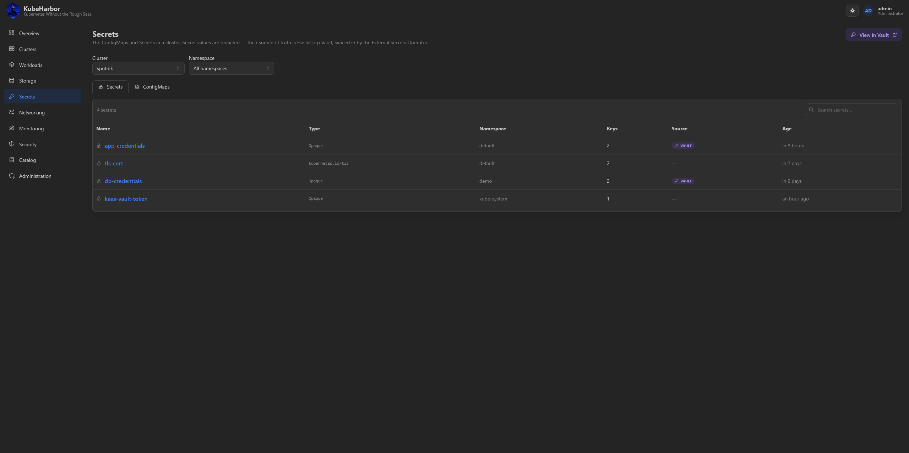
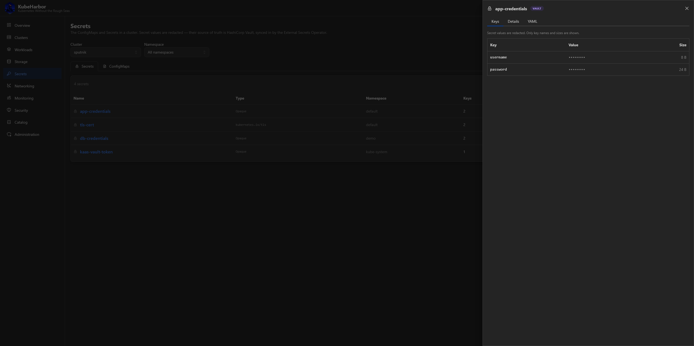
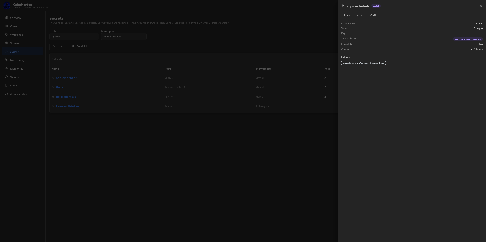
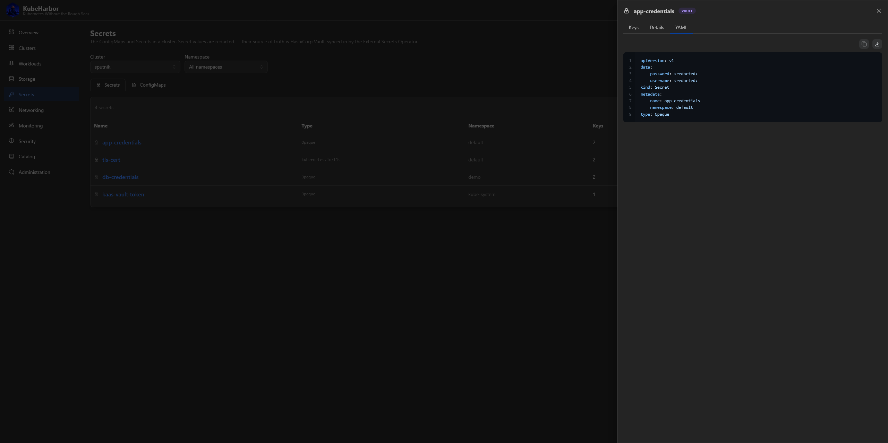

# Secrets

The **Secrets** page shows the ConfigMaps and Secrets inside a cluster - but its real subject is the
platform's [HashiCorp Vault](../deploy/integrations/vault.md) integration. Secret *values* are never
shown here: their source of truth is Vault, synced into the cluster by the **External Secrets
Operator** (bundled in every default cluster). Pick a cluster (and namespace) at the top.

## Secrets and ConfigMaps

Two tabs. The **Secrets** table lists each Secret's name, type, namespace, key count, and **age** - and
a **Source** column with a `VAULT` badge on any Secret that External Secrets materialised from the
platform's Vault. That badge is the whole story: it tells you at a glance which Secrets are managed by
Vault (edit them there and they re-sync) versus created directly in the cluster.

The **ConfigMaps** tab is the same, for non-secret configuration.

## A secret in detail

Click a Secret to open its drawer. Secret **values are redacted** - only the key names and their sizes
are shown, never the plaintext.

The drawer also has **Details** and **YAML** tabs:

## View in Vault

The **View in Vault** button (top right) hands you off into the Vault UI, deep-linked to the right
place, using a short-lived token minted for you. Because the platform keeps Vault's policies mirrored to
its own read/write model, you only ever see and edit the cluster paths you have access to - writers can
edit, readers can only view.

This is where you actually *manage* a cluster's secrets: write them in Vault, and External Secrets syncs
them into the cluster as Kubernetes Secrets. See [the Vault integration](../deploy/integrations/vault.md)
for the layout and how it's wired.
