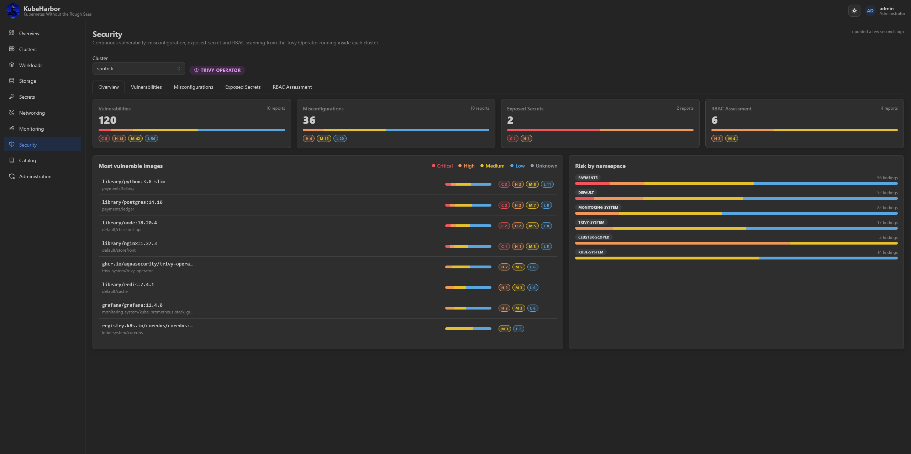
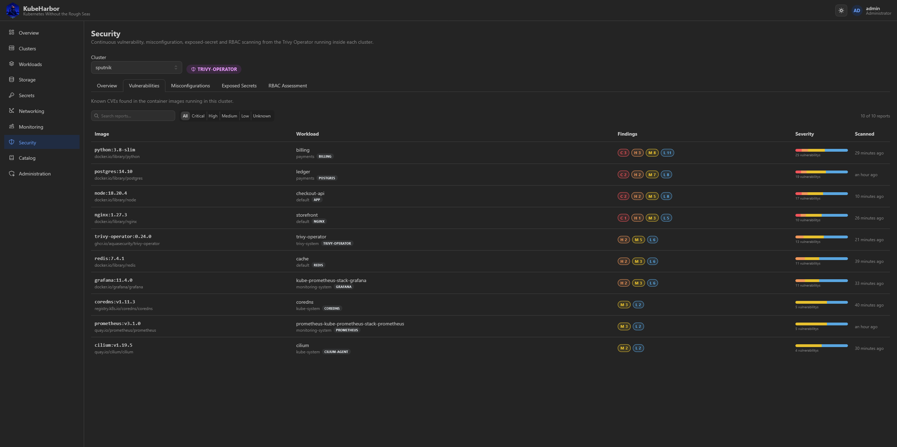
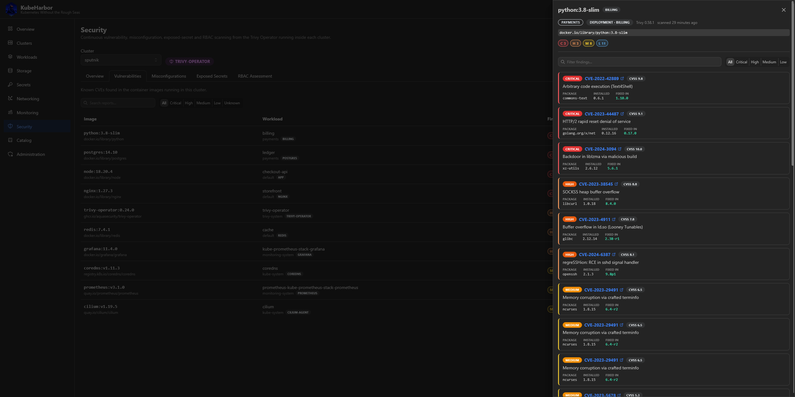
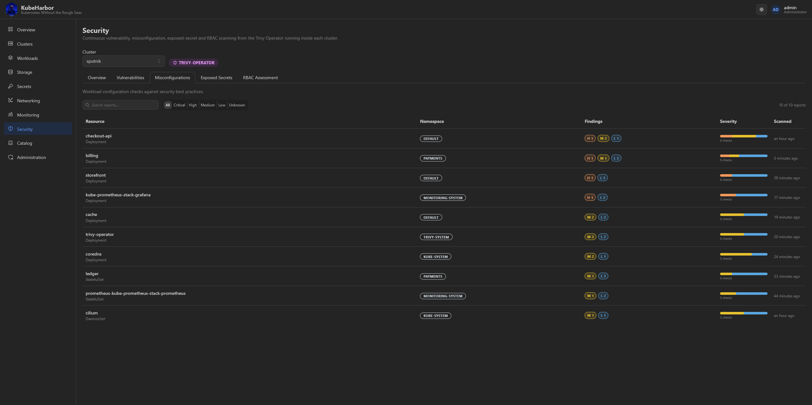
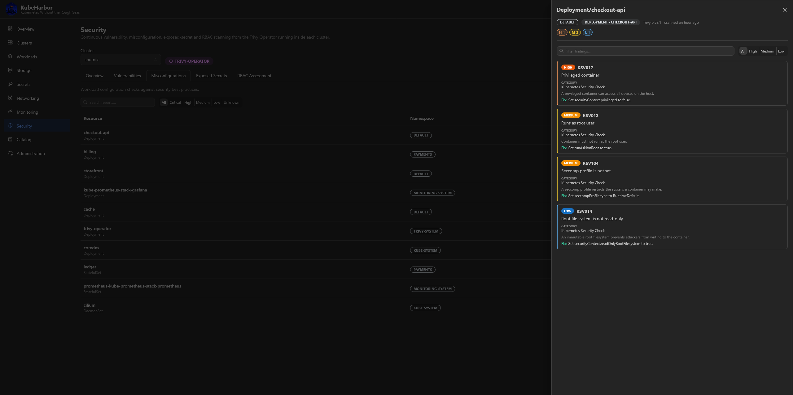
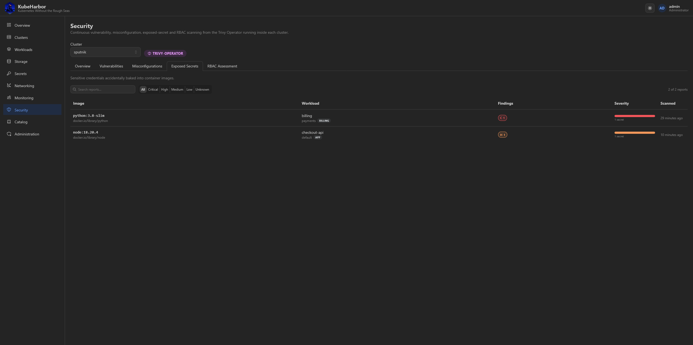
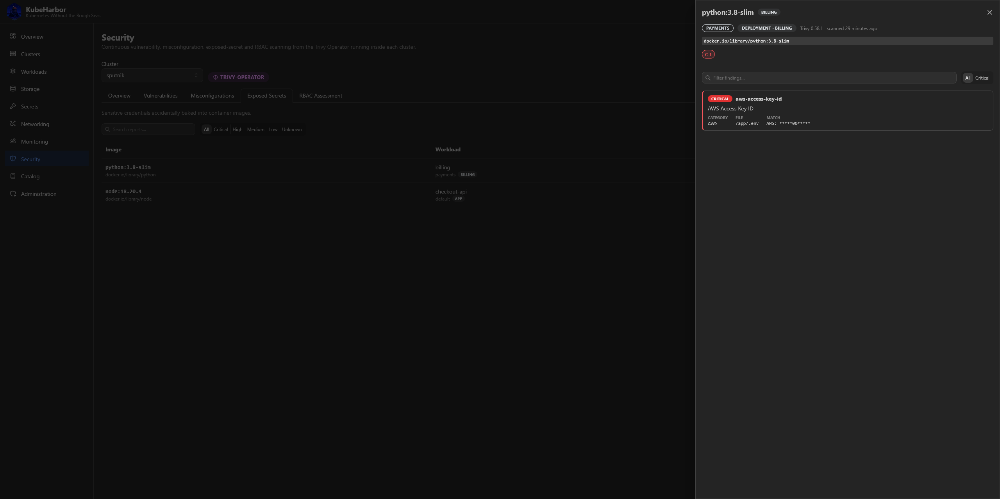
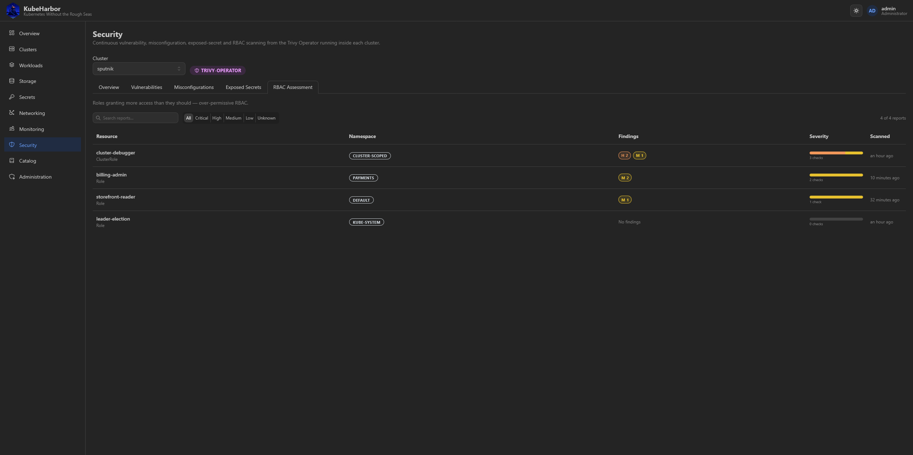
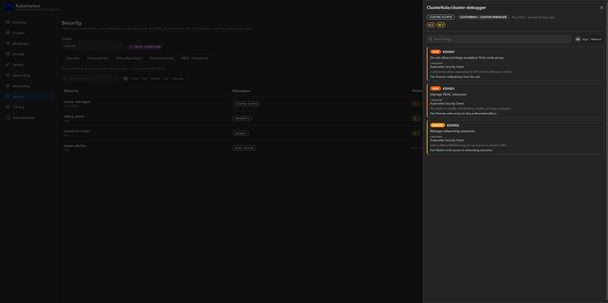

# Security

The **Security** page shows a cluster's security posture, read from the **Trivy Operator**'s report
CRDs - Trivy scans the cluster from the inside and writes its findings back as custom resources, and
this page reads them. The operator ships in every default cluster. Pick a cluster at the top.

## Overview

A cluster-wide summary: per-kind severity rollups, the most vulnerable images, and per-namespace risk -
the fastest way to see where to look first.

## The report families

Four tabs, one per Trivy report type. Each is a searchable, severity-filterable table you can drill
into.

**Vulnerabilities** - image CVEs across the cluster's workloads.

**Misconfigurations** - workload configuration audit findings (ConfigAuditReports).

**Exposed secrets** - secrets baked into container images (Trivy redacts the matched values).

**RBAC assessment** - over-permissive Roles and ClusterRoles.

## Notes

The page is **read-only** and view-scoped - anyone who can see the cluster can read its posture. It
needs no wiring beyond the add-on being installed: Trivy does the scanning inside the cluster, and this
page only reads what it wrote.
