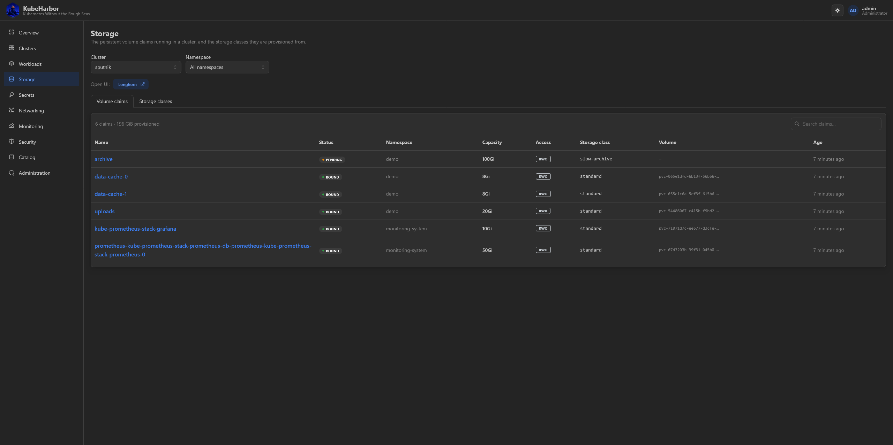
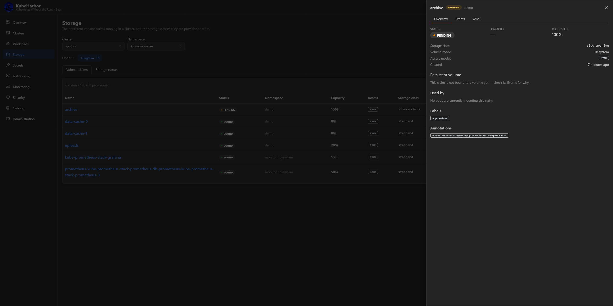
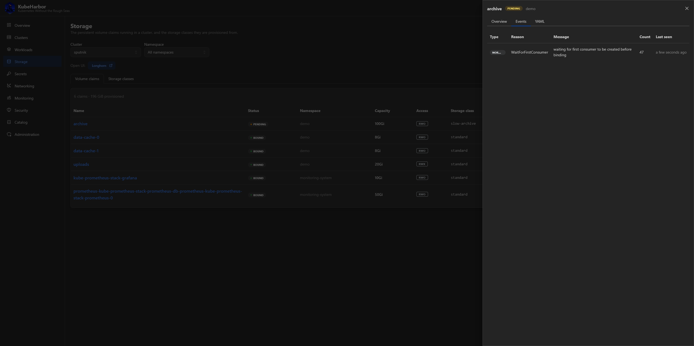
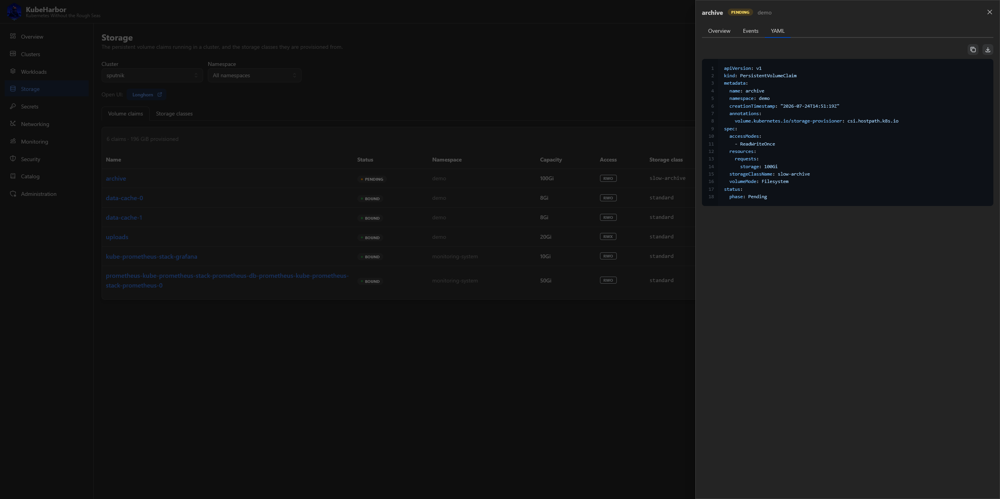
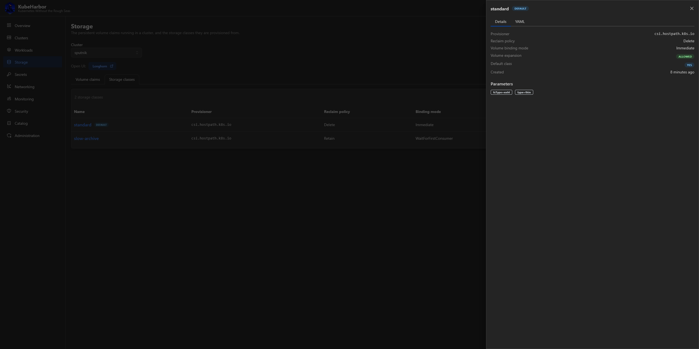
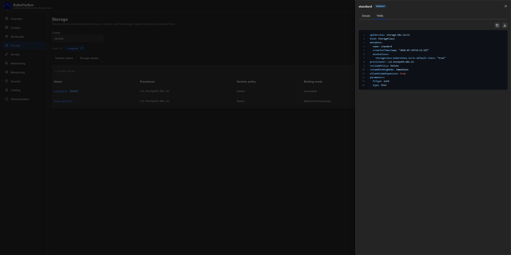

# Storage

The **Storage** page shows a Ready cluster's persistent storage - its PersistentVolumeClaims and
StorageClasses. Pick a cluster (and, for claims, a namespace) at the top.

Because every cluster ships with **Longhorn** as its default StorageClass (see [Creating
clusters](creating-clusters.md)), a bare `PersistentVolumeClaim` with no `storageClassName` gets a
real, replicated volume the moment the cluster is Ready - nothing to configure.

The page is entirely **read-only**. It has two tabs.

## Claims

Per-PVC detail: binding state, capacity granted vs. requested, access modes, the bound
PersistentVolume, and the pods mounting the claim.

Each claim also has **Events** and **YAML**:

## StorageClasses

The cluster's StorageClasses - provisioner, reclaim policy, binding mode, and parameters - with details
and YAML. (StorageClasses are cluster-scoped, so the namespace picker hides on this tab.)

## Growing a cluster's storage

The Storage page shows what exists; to add capacity, attach an **extra disk** to a worker from the
[cluster's Nodes tab](managing-clusters.md#extra-node-disks). A disk mounted under `/var/lib/longhorn*`
becomes Longhorn pool capacity; anywhere else it's an ordinary filesystem.

## Open the Longhorn UI

The Storage page also links to Longhorn's own console (through the platform's [in-cluster UI
tunnel](networking.md)), so you can manage volumes, snapshots, and replicas directly. That link is
write-scoped, since the Longhorn UI can delete volumes.
