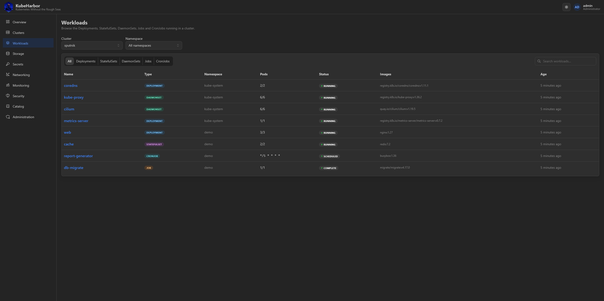
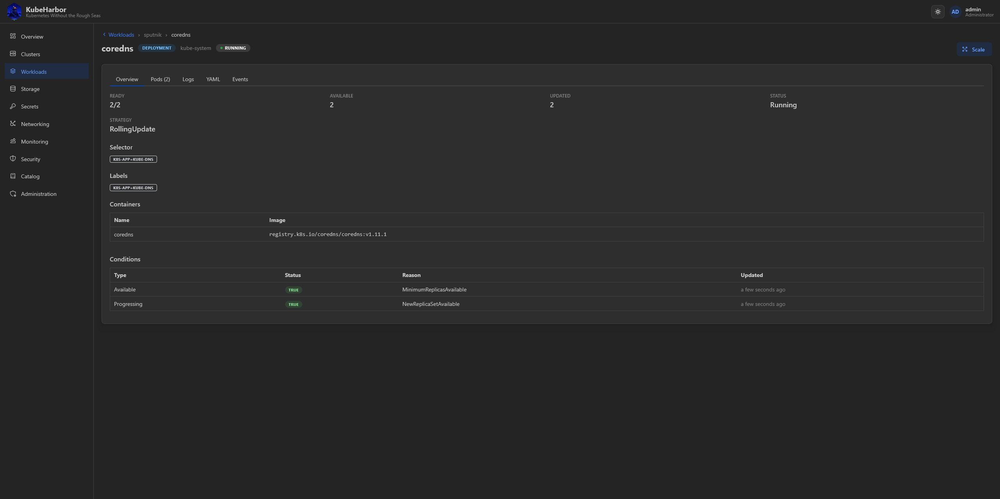
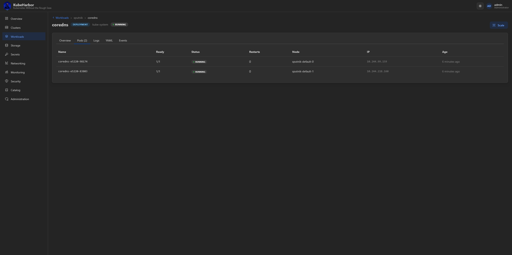
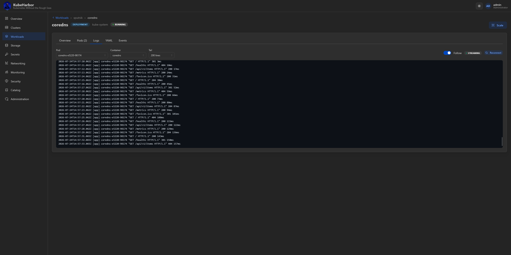
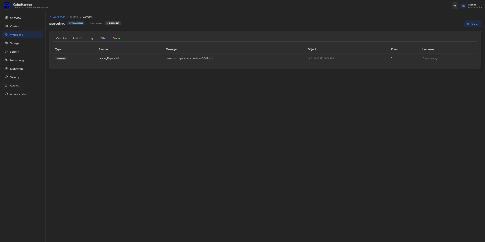
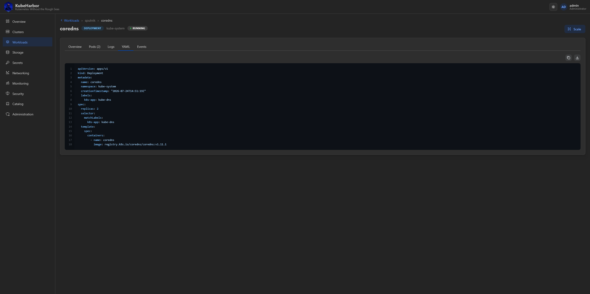

# Workloads

The **Workloads** page is a browser for the live workloads running inside a Ready cluster - the same
things you'd inspect with `kubectl get`, but rendered as a console. Pick a cluster and a namespace at
the top.

It lists **Deployments, StatefulSets, DaemonSets, Jobs, and CronJobs**, each with its rollout state,
replica counts, and images. Click one to open its detail view.

## A workload in detail

The detail view has tabs for everything about a workload:

**Info** - the summary: images, replicas, selectors, strategy, and status conditions.

**Pods** - the pods behind the workload, with their phase, node, restarts, and readiness.

**Logs** - **live-streaming logs** from a pod/container, tailing as they're written.

**Events** - the Kubernetes events for the workload, for spotting scheduling or image-pull trouble.

**YAML** - the full object, as the API server has it.

## Scaling

You can **scale** a Deployment or StatefulSet directly from the page. Reads are view-scoped, but scale
is **write-scoped** - a read-only group member can look but not scale, and gets a 403 if they try. Every
call runs as your own per-user credential, so a reader's kubeconfig is RBAC-limited and the mutation is
both blocked and attributed to the real user.

> This is workload-level scaling (replica counts). To change the *cluster's* worker count, edit a node
> pool on the [cluster's Add-ons tab](managing-clusters.md#add-ons).
